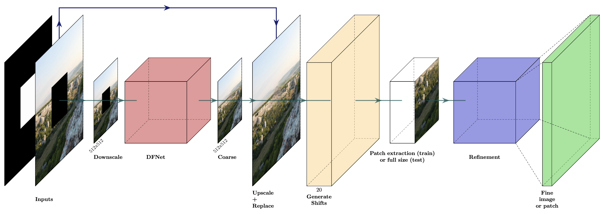
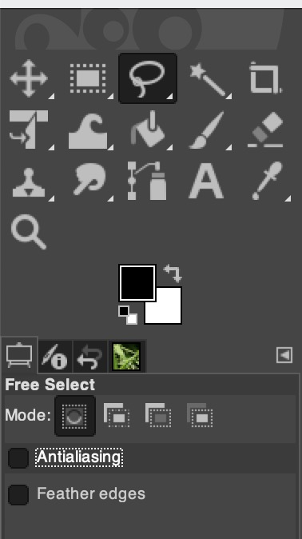

# Deep Two-Stage High-Resolution Image Inpainting

## Abstract
In recent years, the field of image inpainting has developed rapidly, but most deep methods are strongly tied to the resolution of the images on which they were trained. A slight resolution increase leads to artifacts and unsatisfactory filling quality. These methods are therefore unsuitable for interactive image processing. In this article, we propose a method that solves the problem of inpainting arbitrary-size images. We also describe a way to better restore texture fragments in the filled area. Moreover, this approach can work with existing inpainting models, making them resolution independent. We also created a GIMP plugin that implements our technique.


## Testing
### Requirements
* Python 3.7
* Install requirements with ```pip install -r requirements.txt```

### Usage
1) Download [weights](https://drive.google.com/drive/folders/1Zip-XTp7cbVvPZly-TlnBJKavXdiJ8ZN?usp=sharing) and save it in ```weights``` folder.
2) Put your images as shown in ```Test/Inputs```
3) Run: ```python test.py```

### Results from our comparison
You can find all the images involved in our comparison [here](https://drive.google.com/drive/folders/1ivJ4X6wYbLH8BwejLhYEiuoq6tB_u0wj?usp=sharing)

## GIMP plugin
### Tested with
1) GIMP 2.10
2) Ubuntu 18.04 LTS
3) macOS Mojave 10.14.6
### Installation
1) Open GIMP and go to Preferences -> Folders -> Plug-ins, add the folder ```gimp-plugins``` from this repo and close GIMP.  
2) Download [weights](https://drive.google.com/drive/folders/1Zip-XTp7cbVvPZly-TlnBJKavXdiJ8ZN?usp=sharing) and save it in ```gimp-plugins/Inpainting/weights``` folder.  
3) Open terminal and run:  
      ```bash installGimpML.sh```  
4) Open GIMP.
### Usage
You can find example of usage: [youtube](https://youtu.be/7jvqBwRoaVo).  
Please note that the mask <b>must</b> be exactly binary. Otherwise the filling result will be terrible.  
To do this, remove antialiasing in selection:  

```
@article{moskalenko2021method,
  title={Method for Enhancing High-Resolution Image Inpainting with Two-Stage Approach},
  author={Moskalenko, Andrey and Erofeev, Mikhail and Vatolin, D},
  journal={Programming and Computer Software},
  volume={47},
  number={3},
  pages={201--206},
  year={2021},
  publisher={Springer}
}


@article{moskalenko2021deep,
  title={Deep Two-Stage High-Resolution Image Inpainting},
  author={Moskalenko, Andrey and Erofeev, Mikhail and Vatolin, Dmitriy},
  journal={arXiv preprint arXiv:2104.13464},
  year={2021}
}
```

## References
We are largely benefiting from:  
[1] https://github.com/hughplay/DFNet  
[2] https://github.com/kritiksoman/GIMP-ML/  
